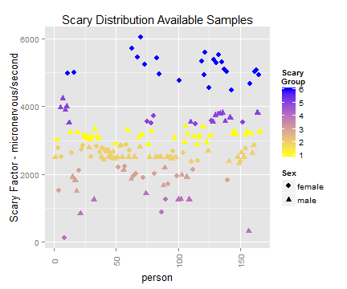
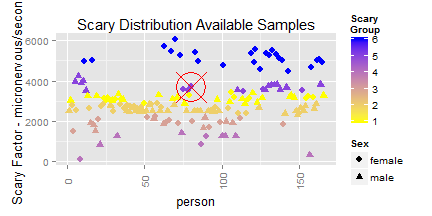

--- 
title       : The Scary Factor Predictor. . .
subtitle    : Developping Data Products - Slidify Project 
author      : jaime laorden
job         : Data Analytics Enthusiastic Novice
framework   : io2012        # {io2012, html5slides, shower, dzslides, ...}
highlighter : highlight.js  # {highlight.js, prettify, highlight}
hitheme     : tomorrow      #
transition  : cube
widgets     : []            # {mathjax, quiz, bootstrap}
mode        : selfcontained # {standalone, draft}
knit        : slidify::knit2slides
logo        : logoscary.jpg
license     : jaime
--- 

## The Scary Factor Predictor. . .

#### Why?   
 

### Have you been invited to a strange party or date?

### Will you go holidays on a "wild" area?

### Do you feel scary becouse of the location...?
        
### Are you in doubt about if to go or not to go...
 
#### Find out. . .      Your scary factor!
 
 

--- &twocol 

## The Scary Factor Predictor. . .

#### How the analysis was done
  

*** =left

## Population

 

*** =right

## Highlights

  
Analysis done with > 150 scary situations
  
Over 20 areas selected
  
Advanced data analitics methods
  
Kmeans Clustering and Regression applied
  
Hihgly acurate results

--- &twocol 

## The Scary Factor Predictor. . .

#### How it works?
### So easy! Choice your variables And click "Calculate"!
 
 
*** =left

- Are you male/female? 
- How are your karate skills? 
- How much do You scream while watching a scary movie? 
- Friends with you? How many? 
- Will it be dark?... Where is it? 

*** =right

 

 

--- {class: class2, id: id2, bg: white}

## The Scary Factor Predictor. . .
#### Additional Amazing Features!   
 

### Evaluate the impact of each variable on scary factor output

 

 

  <a href="https://jaimelaorden.shinyapps.io/Project/" style="font-size:50%;">Visit our Scary Factor Predictor</a>

